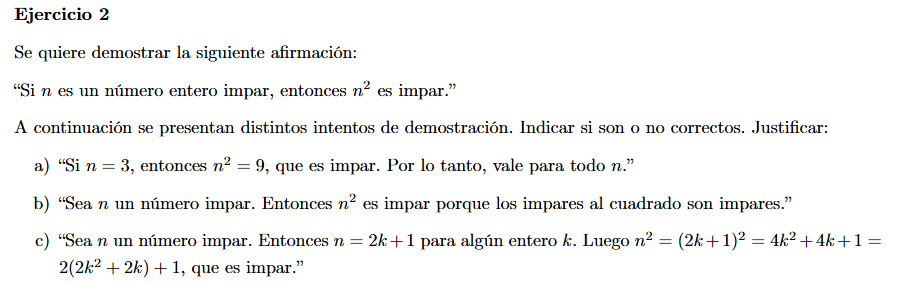
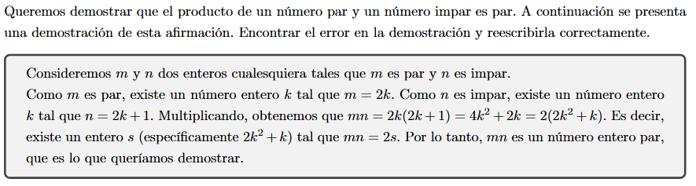

# Practica 1

## Ejercicio 1

Asumo que hay que indicar cuales son tautologías y cuales no.

### A) $(A \land B) \implies A$

La fórmula no es tautología puesto que para $A \equiv True$, $B \equiv False$ se tiene que
$A \land B \equiv False$, por lo tanto: $True \land False \implies False \equiv False$. Pero tampoco es contradicción puesto que para $A \equiv B \equiv True$ obtenemos $ (True \land True) \implies True \equiv True$.

Como la fórmula no es tautología ni contradicción por lo tanto es una contingencia.

## Ejercicio 2

- a) La demostración vale solo para $n=3$.
- b) No es correcta la demostración, no explicá cómo es que el cuadrado de un impar es impar.
- c) No es correcta, se llega al resultado pero no lo explica, por ejemplo con aritmética modular se podría obtener que el primer término de la suma tiene resto igual a 0 con módulo igual a 2, quedando solo el segundo término con resto igual a 1, indicando así que no tiene división entera por 2.

## Ejercicio 3

El error está en cómo define a los números $n, m$, porque:
$$
(m = 2k \land n = 2k + 1) \implies n = m + 1 
$$
Como define a $n = m + 1$ solo demuestra los casos para numeros pares donde uno es sucesor del otro. La manera correcta es definir los números de la siguiente manera. 
$$
\text{Dados } k,q \in \mathbb{Z} \text{, definimos a m y n como: } m = 2k \text{ y } n=2q+1 .\\
\text{Luego se tiene que: }mn= 2k(2q+1) = 4kq+2k= 2(2kq + k).
$$
Por lo tanto para $ s = 2(2kq + k)$ se tiene que $mn=2s$ probando que $mn$ es un entero par.

## Ejercicio 4

La proposición es $P(n): \forall n \in \mathbb{N}, n^2 \leq 3n $. 
Para probar que la proposición es falsa doy el contraejemplo con $n = 4$ ya que $P(4): 4^2 \leq 3·4 \Leftrightarrow  16 \leq 12$ pero es falso que $16 \leq 12 $ y por lo tanto la proposición universal no se cumple.
